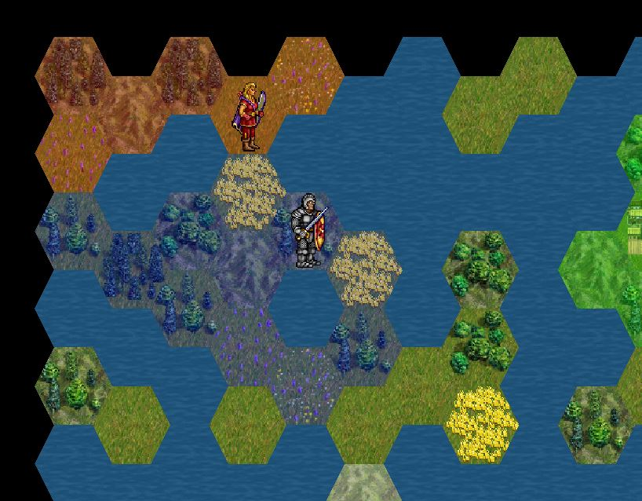
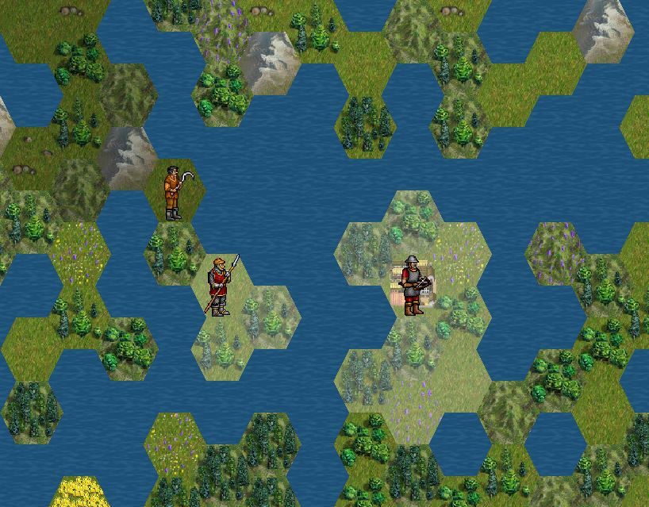

# Hexonomic

This is demo of map generation and base implementation of country/unit system.

## Screenshots

  

  

## Controls

This discribed in Player.cpp file. Methods `void Player::handleEvent(const sf::Event& event, CommandQueue& commands)` and `void Player::handleRealtimeInput(CommandQueue& commands)`.

 - Space - activate/deactivate unit select mode
 - Return - delete country territories
 - Mouse wheel - zoom
 - Pressed right mouse button - scroll map
 - 1..8 - set country color

## How I can run this

Simplest way to run this application is download [Release](https://github.com/apsect/Hexonomic/tree/master/Release) folder and run [Hexonomic.exe](https://github.com/apsect/Hexonomic/blob/master/Release/Hexonomic.exe). But if you want to get compiled files you must read [SFML official instruction](https://www.sfml-dev.org/tutorials/2.4/start-vc.php) first.

## Libraries used on the project

* [SFML](https://github.com/SFML/SFML)

## Additional information

Here were using few code files from [SFML Game Development Book](https://github.com/SFML/SFML-Game-Development-Book)
